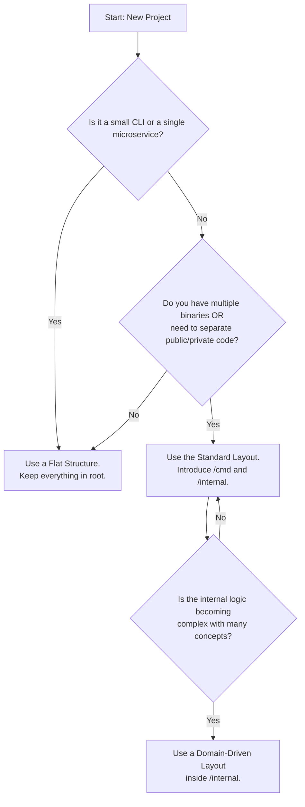

# Go Project Structure

## Table of Contents
- [Go Project Structure](#go-project-structure)
  - [Table of Contents](#table-of-contents)
  - [The Philosophy of Project Layout](#the-philosophy-of-project-layout)
  - [Decision Flowchart: Which Structure to Use?](#decision-flowchart-which-structure-to-use)
  - [Level 1: The Simple, Flat Structure](#level-1-the-simple-flat-structure)
  - [Level 2: The Standard Go Project Layout](#level-2-the-standard-go-project-layout)
    - [The `/cmd` Directory](#the-cmd-directory)
    - [The `/internal` Directory](#the-internal-directory)
    - [The `/pkg` Directory: A Word of Caution](#the-pkg-directory-a-word-of-caution)
  - [Level 3: Domain-Driven Layout](#level-3-domain-driven-layout)
  - [Packages: Layers vs. Features](#packages-layers-vs-features)
  - [A Recommended Structure for a Web Service](#a-recommended-structure-for-a-web-service)
  - [Project Structure Best Practices](#project-structure-best-practices)

## The Philosophy of Project Layout

Unlike some frameworks that enforce a strict directory structure, Go is more flexible. However, community-developed patterns have emerged to help manage complexity as projects grow.

-   **Start Simple:** Don't create a complex directory structure until you need it.
-   **Clarity and Intent:** The structure should make it easy to find code and understand the purpose of each package.
-   **Enforce Separation:** Use packages and the `internal` directory to create clear boundaries.

## Decision Flowchart: Which Structure to Use?



## Level 1: The Simple, Flat Structure

For a small application or a single-purpose library, a flat hierarchy is ideal.

```
/my-project
├── go.mod
├── go.sum
├── main.go         // Your main application logic.
├── handlers.go     // HTTP handlers, if it's a web service.
├── handlers_test.go
└── models.go       // Your data structures.
```
**When to move on:** When the number of files becomes overwhelming or when you need to build multiple binaries from the repository.

## Level 2: The Standard Go Project Layout

This is a well-known community standard. Pick and choose only the directories you need.

Reference: [Standard Go Project Layout](https://github.com/golang-standards/project-layout)

### The `/cmd` Directory

**Purpose:** To house the `main` package for each binary you want to build. The `main.go` file here should be a small entrypoint that imports and calls code from `/internal` to do the actual work.

```
/cmd
├── /my-api-server/main.go
└── /my-cli-tool/main.go
```

### The `/internal` Directory

**Purpose:** To store all the code that is **not meant to be imported** by other projects. This is a special directory enforced by the Go compiler. The bulk of your application logic—HTTP handlers, business logic, data access—lives here.

### The `/pkg` Directory: A Word of Caution

**Purpose:** To store packages that are safe to be imported and used by external applications.

**Warning:** This is the most misunderstood directory. Before putting a package here, ask yourself: "Do I intend to support and maintain this as a public, versioned library?" If the answer is no, **it belongs in `/internal`**. Most applications will never need a `/pkg` directory.

## Level 3: Domain-Driven Layout

As your `internal` directory grows, structure it by business domain or feature. This keeps related code together and makes the system easier to understand.

```
/internal/
├── platform/         # Cross-cutting concerns, framework-level code.
│   ├── database/     # Database connection, migrations.
│   └── server/       # HTTP server setup, routing, middleware.
├── user/             # "User" domain.
│   ├── user.go       # The User model and business logic.
│   ├── repository.go # The interface for user storage (e.g., UserRepository).
│   └── handler.go    # HTTP handlers for /users endpoints.
├── payment/          # "Payment" domain.
│   ├── payment.go
│   ├── repository.go
│   └── handler.go
└── auth/             # "Auth" domain, which depends on User.
    └── token.go
```

## Packages: Layers vs. Features

There are two main schools of thought for structuring packages inside `/internal`:

1.  **By Layer (Less Recommended):**
    ```
    /internal
    ├── handlers/
    ├── models/
    └── storage/
    ```
    This often leads to packages with low cohesion, where unrelated features are grouped together just because they are the same "type" of code. It also creates import cycles and tight coupling.

2.  **By Feature (Recommended):**
    ```
    /internal
    ├── user/
    ├── product/
    └── payment/
    ```
    This is the domain-driven approach shown above. It is more modular, scalable, and easier to navigate. Each package is self-contained and exposes only what's necessary.

## A Recommended Structure for a Web Service

```
/my-awesome-api
├── go.mod
├── go.sum
├── README.md
├── configs/
│   ├── config.yml
│   └── config.dev.yml
├── cmd/
│   └── api/
│       └── main.go           # Wires everything together and starts the server.
└── internal/
    ├── platform/
    │   ├── database/
    │   │   └── postgres.go   # Logic for connecting to the database.
    │   └── server/
    │       ├── server.go     # The http.Server setup.
    │       └── routes.go     # All the API routes, pointing to handlers.
    ├── user/
    │   ├── user.go           # The User model.
    │   ├── service.go        # Business logic.
    │   ├── handler.go        # HTTP handlers for /users endpoints.
    │   └── postgres.go       # Implementation of the user repository for Postgres.
    └── auth/
        ├── auth.go           # Auth service and logic.
        └── middleware.go     # Auth middleware for the server.
```

## Project Structure Best Practices

1.  **Start Simple and Evolve:** Begin with a flat structure. Only add directories like `/cmd` and `/internal` when you have a clear need for them.
2.  **Use `/internal` for Your Business Logic:** Protect your implementation details. Most of your code should probably live here.
3.  **Be Deliberate About `/pkg`:** Don't create a `/pkg` directory unless you intend to share that code as a library for others to import.
4.  **Keep `main` Packages Small:** The code in `/cmd/app/main.go` should be minimal. It's for setup and wiring, not business logic.
5.  **Group by Feature, Not Layer:** As your project grows, structuring by feature (e.g., `/internal/user`) is clearer and more scalable than structuring by layer (e.g., `/internal/handlers`).

---

Next: [Dependency Management](14-dependency-management.md) 